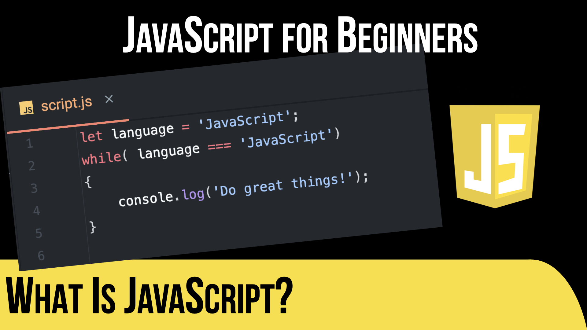

# 🚀 JavaScript for Beginners 🚀

This code supplements the JavaScript for Beginners course that is available on [TekCasts](https://tekcasts.com):

‼️ What Is Covered?

- What Is JavaScript? [video](https://tekcasts.com/play/javascript-for-beginners-what-is-javascript)
- Hello from JavaScript [code](video_02/index.html) | [video](https://tekcasts.com/play/javascript-for-beginners-setting-up-the-environment)
- Your First Script [code](video_03/script.js) | [video](https://tekcasts.com/play/javascript-for-beginners-your-first-script)
- Variables & Data Types [code](video_04/script.js) | [video](https://tekcasts.com/play/javascript-for-beginners-variables-data-types )
- Operators & Expressions [code](video_05/script.js) | [video](https://tekcasts.com/play/javascript-for-beginners-operators-expressions)
- Control Flow - Conditionals [code](video_06/script.js) | [video](https://tekcasts.com/play/javascript-for-beginners-control-flow-conditionals)
- Control Flow - Loops [code](video_07/script.js) | [video](https://tekcasts.com/play/javascript-for-beginners-control-flow-loops)
- Defining and Calling Functions [code](video_08/script.js) | [video](https://tekcasts.com/play/javascript-for-beginners-defining-and-calling-functions)
- Parameters, Return Values, and Scope [code](video_09/script.js) | [video](https://tekcasts.com/play/javascript-for-beginners-parameters-return-values-and-scope)
- Functions as Values (Intro to Callbacks) [code](video_10/script.js) | [video](https://tekcasts.com/play/javascript-for-beginners-functions-as-values-callbacks)
- Arrays - Working with Lists [code](video_11/script.js) | [video](https://tekcasts.com/play/https://tekcasts.com/play/javascript-for-beginners-what-is-javascript)
- Looping Through Arrays [code](video_12/script.js) | [video](https://tekcasts.com/play/https://tekcasts.com/play/javascript-for-beginners-what-is-javascript)
- Objects - Key/Value Pairs [code](video_13/script.js) | [video](https://tekcasts.com/play/https://tekcasts.com/play/javascript-for-beginners-what-is-javascript)
- Nested Structures and Loops with Objects [code](video_14/script.js) | [video](https://tekcasts.com/play/https://tekcasts.com/play/javascript-for-beginners-what-is-javascript)
- Destructuring & Spread Syntax [code](video_15/script.js) | [video](https://tekcasts.com/play/https://tekcasts.com/play/javascript-for-beginners-what-is-javascript)
- Template Literals [code](video_16/script.js) | [video](https://tekcasts.com/play/https://tekcasts.com/play/javascript-for-beginners-what-is-javascript)
- Error Handling [code](video_17/script.js) | [video](https://tekcasts.com/play/https://tekcasts.com/play/javascript-for-beginners-what-is-javascript)
- Closures and Lexical Scope [code](video_18/script.js) | [video](https://tekcasts.com/play/https://tekcasts.com/play/javascript-for-beginners-what-is-javascript)
- Higher-Order Functions [code](video_19/script.js) | [video](https://tekcasts.com/play/https://tekcasts.com/play/javascript-for-beginners-what-is-javascript)
- Recursion [code](video_20/script.js) | [video](https://tekcasts.com/play/https://tekcasts.com/play/javascript-for-beginners-what-is-javascript)
- Async Functions [code](video_21/script.js) | [video](https://tekcasts.com/play/https://tekcasts.com/play/javascript-for-beginners-what-is-javascript)
- OOP - Constructor Functions & Prototypes [code](video_22/script.js) | [video](https://tekcasts.com/play/https://tekcasts.com/play/javascript-for-beginners-what-is-javascript)
- OOP - ES6 Classes [code](video_23/script.js) | [video](https://tekcasts.com/play/https://tekcasts.com/play/javascript-for-beginners-what-is-javascript)
- OOP - Inheritance [code](video_24/script.js) | [video](https://tekcasts.com/play/https://tekcasts.com/play/javascript-for-beginners-what-is-javascript)
- Modules & Imports [code](video_25/script.js) | [video](https://tekcasts.com/play/https://tekcasts.com/play/javascript-for-beginners-what-is-javascript)
